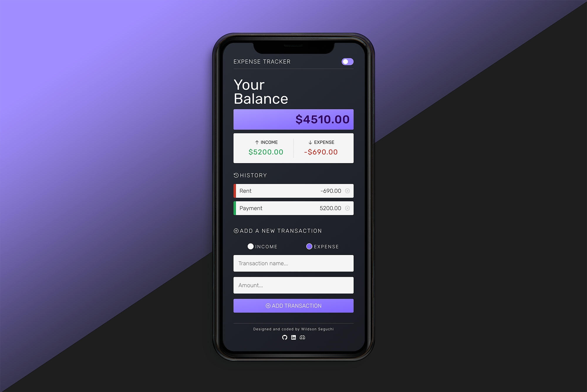

# Expense Tracker

## Welcome / Bem vindo!

Thanks for checking out my front-end project. 
🇧🇷/🇵🇹 _Obrigado por conferir meu projeto de front-end._

## Overview

An app to keep track of income and expenses. 
_Um aplicativo para controlar suas rendas e despesas._

## Built with

- React JS;
- React Context API;
- Mobile-first workflow;
- Radix Icons.

## Features

- Dark and Light modes;
- Displays transaction items in DOM;
- Shows balance, expense and income totals;
- Adds new transactions and reflects in total;
- Deletes items from DOM.

## Links

- App URL (Deploy): [https://wseguchi.github.io/expense-tracker/](https://wseguchi.github.io/expense-tracker/)
- Github Repository: [https://github.com/wseguchi/expense-tracker](https://github.com/wseguchi/expense-tracker)

## Author

## Author

- Wildson Seguchi
- [Github](https://github.com/wseguchi)
- [LinkedIn](https://www.linkedin.com/in/wildson-seguchi/?locale=en_US)
